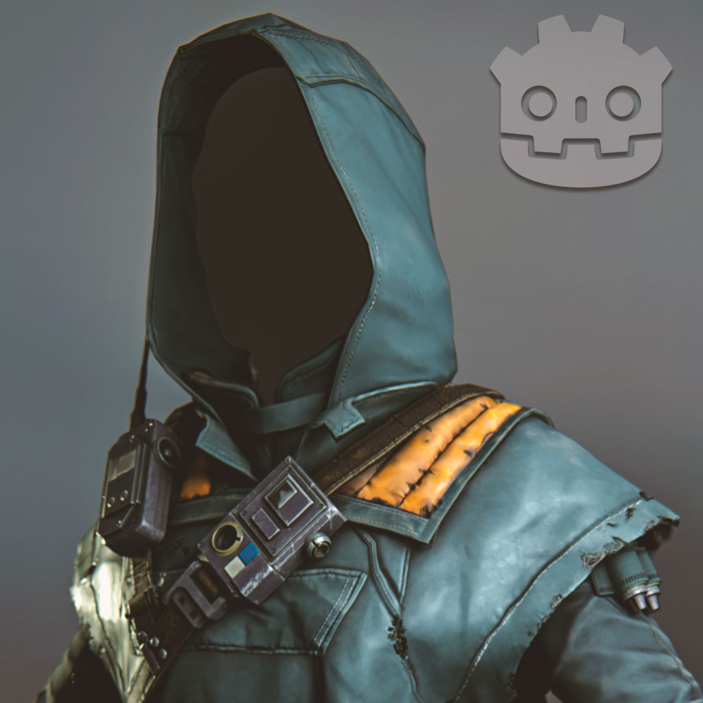

# Scrappers Guild Poncho Viewer

A 3D viewer for a poncho model inspired by the Bracca scrappers from Star Wars Jedi: Fallen Order. Built in Godot 4.6.1 as an educational study project.



## ⚠️ Disclaimer

This project is **not affiliated with**, **endorsed by**, or **associated with** Lucasfilm, Disney, or Respawn Entertainment.

All intellectual property related to Star Wars, including characters, costumes, designs, and the Bracca setting, is owned by Lucasfilm Ltd. and Disney.

This model was created for **educational and study purposes only**. It is not intended for commercial use, redistribution, or claiming as your own work.

## 📜 License

**CC BY-NC-SA 4.0** (Creative Commons Attribution-NonCommercial-ShareAlike 4.0)

- ✅ **Allowed**: Study, analysis, and personal learning
- ✅ **Allowed**: Sharing with credit
- ✅ **Allowed**: Creating derivative works with attribution
- ❌ **Forbidden**: Any commercial use
- ❌ **Forbidden**: Selling or including in paid products
- ❌ **Forbidden**: Claiming ownership of the original IP

See [LICENSE](LICENSE) for full details.

## 🎮 How to Run

1. Download and install [Godot 4.6.1](https://godotengine.org/download) (not 4.7+)
2. Clone or download this repository
3. Open the project in Godot
4. Press **F5** or click **Run** to start the viewer

### Controls
- **Left Click + Drag**: Rotate camera
- **Scroll Wheel**: Zoom in/out
- **Right Click + Drag**: Pan camera

## 📁 Project Structure

```
Scrappers-Guild-StarWars/
├── Assets/                  # 3D models and textures
├── Scenes/                  # Godot scenes
├── addons/                  # Godot addons
├── Thumb.jpg               # Preview thumbnail
├── project.godot           # Godot project file
├── export_presets.cfg      # Export configuration
├── LICENSE                 # CC BY-NC-SA 4.0 license
└── README.md               # This file
```

## 🎯 Purpose

This project was created to help visualize and study:
- 3D modeling for games
- Godot engine workflows
- Character asset presentation

## 📝 Credits

- **3D Model**: Created by Talesrt
- **Inspired by**: Star Wars Jedi: Fallen Order (Respawn Entertainment / Lucasfilm)
- **Engine**: Godot 4.6.1

---

*This project is for educational purposes only. All Star Wars-related IP belongs to Lucasfilm and Disney.*
